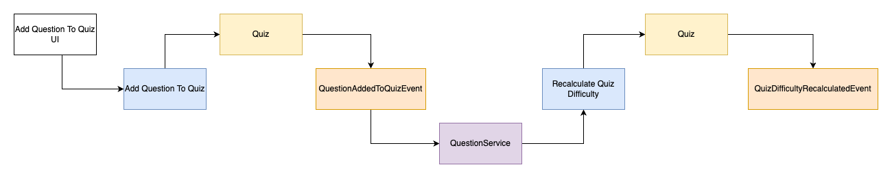

# README #

### What is this repository for? ###

* Create A Quiz
* Add Questions to Quiz

### How do I get set up? ###

* Install JDK 11+
* Install Maven

### Contribution guidelines ###

* Write Unit tests for all new Code
* Pull Requests are required when merging to Main
* Update Readme with new Functionality

### Who do I talk to? ###

* Repo owner or admin
* Other community or team contact

### Documentation ###
Code is Setup in DDD.

#### Add Question To Quiz ####
